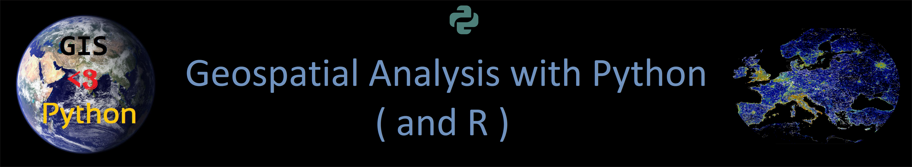

Welcome to Geospatial Analysis with Python and R (the Python part)
==================================================================

**Automating Geospatial Analysis and GIS-processes**: The course teaches you how to do different GIS-related tasks in the Python programming language. Each lesson is a tutorial with specific topic(s) where the aim is to learn
how to solve common GIS-related problems and tasks using Python tools. In the lessons we use only publicly available data which can be used and downloaded by anyone anywhere.
In this course, we assume that you know the basics of Python programming - but we will also repeat Python basics in order to refresh everyone's memory.

**Synopsis**

To understand and explore the benefits of using a non-gui (coding/scripting) approach to method development for spatial analytics and statistics, based on the standard approaches of widely used and integrated scripting environments (Python and R).

This is an introductory course on concepts, skills, and tools for working with the Python and R scripting environments.
Obtain acquaintanceship with practical Python and R libraries for everyday scientific and professional GIS use, with a focus on automating different standard GIS-related tasks that support clear documentation of methods and productivity.
These lessons assume no prior knowledge of the skills or tools. It is a hands-on teaching course, so the majority of this course will be together in front of a computer and working on exercises.

Course format
-------------

The majority of this course will be spent in front of a computer learning to program in the Python language and working on exercises.

The computer exercises will focus on developing basic programming skills using the Python language and applying those skills to various GIS related problems.
Typical exercises will involve a brief introduction followed by topical computer-based tasks. At the end of the exercises, you may be asked to submit answers
to relevant questions, some related plots, and/or Python codes you have written or used. You are encouraged to discuss and work together with other students
on the laboratory exercises, however the independent assignment write-ups that you submit must be completed individually and must clearly reflect your own work.

.. admonition:: Open Access!

    The aim of this course is to share the knowledge and help people to get started with their journey for doing GIS more efficiently and in a reproducible manner
    using Python programming. This course is using many parts on the following course:

    - `Auto-GIS course University of Helsinki <https://automating-gis-processes.github.io/2017/>`__

    Read more about open licensing terms from `here <course-info/License-terms.html>`_.

Course topics
-------------

The materials are divided into several sections:

+----------------+---------------------------------+
| Time           | Theme                           |
+================+=================================+
| **Lesson 0**   | Recap Getting started Python;   |
|                | Setup Miniconda environments;   |
|                | Jupyter Notebooks               |
|                |                                 |
+----------------+---------------------------------+
| **Lesson 1**   | GIS in Python;                  |
|                | Git Versioning Control System;  |
|                | Spatial data model;             |
|                | Geometric Objects; Shapely      |
|                |                                 |
+----------------+---------------------------------+
| **Lesson 2**   | Introduction to Git;            |
|                | Working with GeoDataFrames;     |
|                | Managing projections;           |
|                | Table join;                     |
|                |                                 |
+----------------+---------------------------------+
| **Lesson 3**   | Geocoding and making spatial    |
|                | queries                         |
|                |                                 |
+----------------+---------------------------------+
| **Lesson 4**   | Geometric operations;           |
|                | Reclassifying data with Pysal   |
|                |                                 |
+----------------+---------------------------------+
| **Lesson 5**   | Visualization, making static    |
|                | and interactive maps            |
|                |                                 |
+----------------+---------------------------------+

Contents
--------
*Lesson content, readings and due dates are subject to change*

**We will make more contents visible during the course**

.. toctree::
   :maxdepth: 2
   :caption: Course information

   course-info/Intro-Python-GIS
   course-info/course-info
   course-info/License-terms

.. toctree::
   :maxdepth: 2
   :caption: Lesson 0

   lessons/L0/overview
   lessons/L0/Installing_Miniconda_GIS
   lessons/L0/recap-python

.. toctree::
   :maxdepth: 2
   :caption: Lesson 1

   lessons/L1/overview
   lessons/L1/Geometric-Objects
   lessons/L1/ex-1
   lessons/L1/exercise-1-hints
   lessons/L1/lecture

.. toctree::
   :maxdepth: 2
   :caption: Lesson 2

   lessons/L2/overview
   lessons/L2/Introduction-GIT
   lessons/L2/spyder-ide
   lessons/L2/geopandas-basics
   lessons/L2/projections
   lessons/L2/ex-2
   lessons/L2/exercise-2-hints
   lessons/L2/lecture

.. commented out
   lessons/L2/more-git-hints

.. toctree::
   :maxdepth: 2
   :caption: Lesson 3

   lessons/L3/overview
   lessons/L3/geocoding
   lessons/L3/point-in-polygon
   lessons/L3/spatial-join
   lessons/L3/nearest-neighbour
   lessons/L3/ex-3
   lessons/L3/exercise-3-hints
   lessons/L3/lecture

.. toctree::
   :maxdepth: 2
   :caption: Lesson 4

   lessons/L4/overview
   lessons/L4/reclassify
   lessons/L4/geometric-operations
   lessons/L4/ex-4
   lessons/L4/exercise-4-hints
   lessons/L4/lecture

.. toctree::
   :maxdepth: 2
   :caption: Lesson 5

   lessons/L5/overview
   lessons/L5/static-maps
   lessons/L5/interactive-map-bokeh
   lessons/L5/advanced-bokeh
   lessons/L5/interactive-map-folium
   lessons/L5/share-on-github
   lessons/L5/ex-5
   lessons/L5/exercise-5-hints
   lessons/L5/lecture
