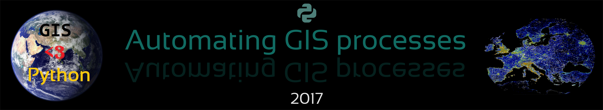

Welcome to Geospatial Analysis with Python and R (the Python part)
==================================================================

**Automating Geospatial Analysis and GIS-processes**: The course teaches you how to do different GIS-related tasks in Python programming language. Each lesson is a tutorial with specific topic(s) where the aim is to learn
how to solve common GIS-related problems and tasks using Python tools. In the lessons we use only publicly available data which can be used and downloaded by anyone anywhere. In this course,
we assume that you know the basics of Python programming.

Course format
-------------

The majority of this course will be spent in front of a computer learning to program in the Python language and working on exercises.

The computer exercises will focus on developing basic programming skills using the Python language and applying those skills to various GIS related problems.
Typical exercises will involve a brief introduction followed by topical computer-based tasks. At the end of the exercises, you may be asked to submit answers
to relevant questions, some related plots, and/or Python codes you have written or used. You are encouraged to discuss and work together with other students
on the laboratory exercises, however the independent assignment write-ups that you submit must be completed individually and must clearly reflect your own work.

.. admonition:: Open Access!

    The course is **open for everyone**. The aim of this course is to share the knowledge and help people to get started with their journey for doing GIS more efficiently and in a reproducible manner
    using Python programming.

    - `Auto-GIS course University of Helsinki <https://automating-gis-processes.github.io/2017/>`__

    Please read more about how to do it from `here <License-terms.html>`_.

Course topics
-------------

The materials are divided into several sections:

+----------------+---------------------------------+
| Time           | Theme                           |
+================+=================================+
| **Lesson 1**   | Recap Getting started Python;   |
|                | Setup Anaconda and Git;         |
|                | Jupyter Notebooks               |
|                |                                 |
+----------------+---------------------------------+
| **Lesson 2**   | GIS in Python;                  |
|                | Spatial data model;             |
|                | Geometric Objects; Shapely      |
|                |                                 |
+----------------+---------------------------------+
| **Lesson 3**   | Working with GeoDataFrames;     |
|                | Managing projections;           |
|                | Table join;                     |
|                |                                 |
+----------------+---------------------------------+
| **Lesson 4**   | Geocoding and making spatial    |
|                | queries                         |
|                |                                 |
+----------------+---------------------------------+
| **Lesson 5**   | Geometric operations;           |
|                | Reclassifying data with Pysal   |
|                |                                 |
+----------------+---------------------------------+
| **Lesson 6**   | Visualization, making static    |
|                | and interactive maps            |
|                |                                 |
+----------------+---------------------------------+

Contents
--------
*Lesson content, readings and due dates are subject to change*

.. toctree::
   :maxdepth: 2
   :caption: Course information

   course-info/course-info
   course-info/License-terms

.. toctree::
   :maxdepth: 2
   :caption: Lesson 1

   lessons/L0/overview
   lessons/L0/Installing_Anacondas_GIS
   lessons/L0/Introduction-GIT
   lessons/L0/recap-python

.. toctree::
   :maxdepth: 2
   :caption: Lesson 2

   lessons/L1/Intro-Python-GIS
   lessons/L1/overview
   lessons/L1/lecture
   lessons/L1/Geometric-Objects
   lessons/L1/ex-1
   lessons/L1/exercise-1-hints

.. toctree::
   :maxdepth: 2
   :caption: Lesson 3

   lessons/L2/overview
   lessons/L2/lecture
   lessons/L2/geopandas-basics
   lessons/L2/projections
   lessons/L2/using-functions
   lessons/L2/ex-2
   lessons/L2/exercise-2-hints

.. toctree::
   :maxdepth: 2
   :caption: Lesson 4

   lessons/L3/overview
   lessons/L3/lecture
   lessons/L3/geocoding
   lessons/L3/point-in-polygon
   lessons/L3/spatial-join
   lessons/L3/nearest-neighbour
   lessons/L3/ex-3
   lessons/L3/exercise-3-hints

.. toctree::
   :maxdepth: 2
   :caption: Lesson 5

   lessons/L4/overview
   lessons/L4/lecture
   lessons/L4/reclassify
   lessons/L4/geometric-operations
   lessons/L4/ex-4
   lessons/L4/exercise-4-hints

.. toctree::
   :maxdepth: 2
   :caption: Lesson 6

   lessons/L5/overview
   lessons/L5/lecture
   lessons/L5/static-maps
   lessons/L5/interactive-map-bokeh
   lessons/L5/advanced-bokeh
   lessons/L5/interactive-map-folium
   lessons/L5/share-on-github
   lessons/L5/ex-5
   lessons/L5/exercise-5-hints

