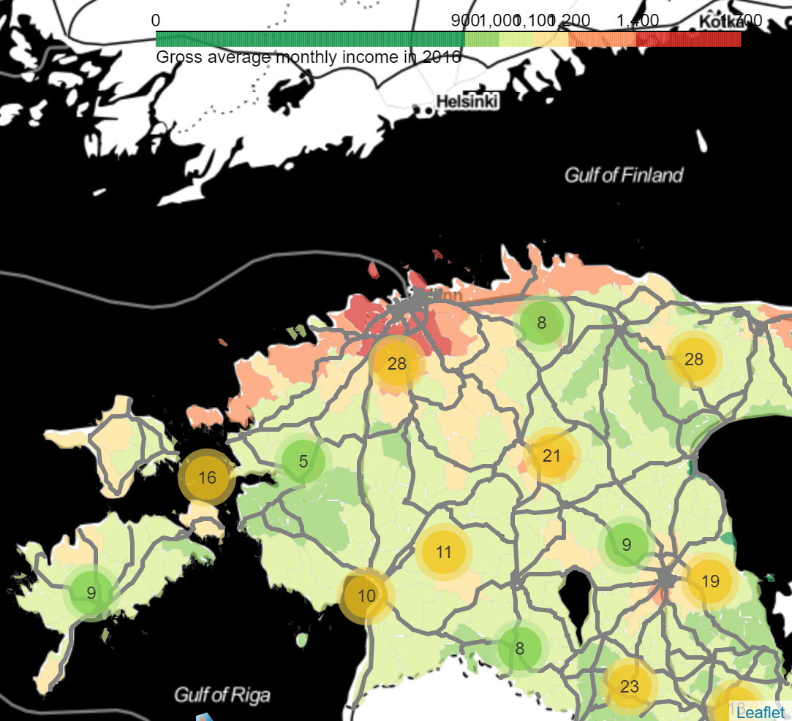
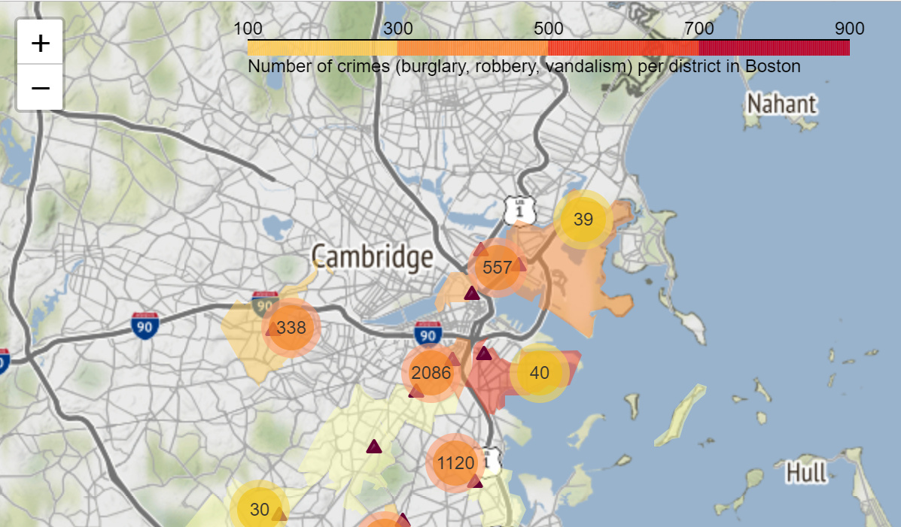
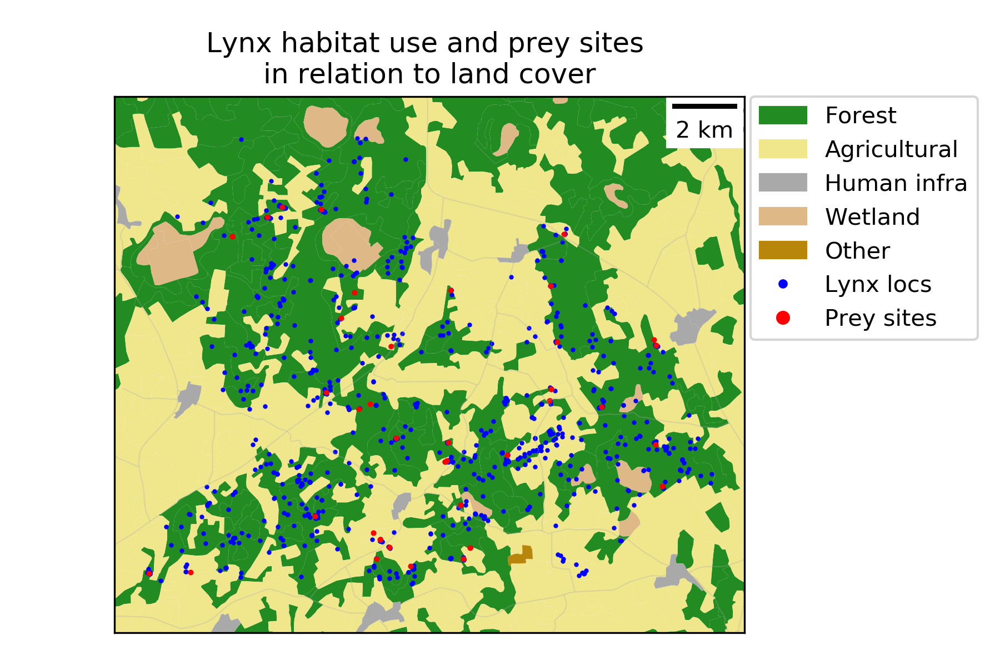
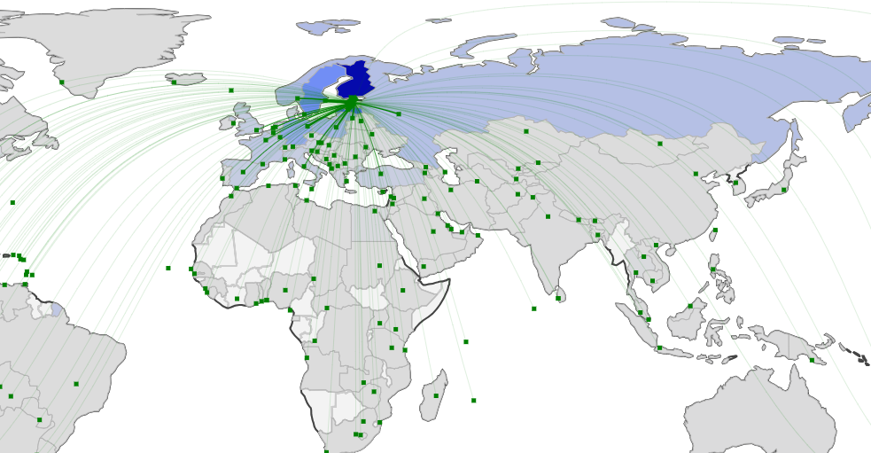
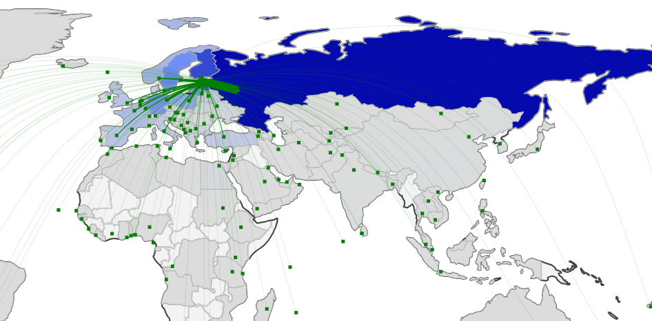

Examples 2018
=============

Birth rate and average income in Estonia in 2016
------------------------------------------------

Daiga Paršova, static map with geopandas/matplotlib

"Birth rate in Estonia in 2016"

.. image:: ../../_static/examples/BirthRateEstonia.png

"Gross average monthly income in Estonia in 2016"

`Click here to view interactive version! <../../_static/examples/daiga-parsova-Income2016.html>`_

Number of crimes (burglary, robbery, vandalism) per district in Boston
----------------------------------------------------------------------

by Katharina Fogelberg, dynamic map with Leaflet

`Click here to view interactive version! <../../_static/examples/interactive_map.html>`_

Lynx habitat use and land cover
-------------------------------

by Raido Kont, static map with geopandas/matplotlib

Estonian vs Russian speakers outbound travel (from Estonia to international destinations) 2014-2016
---------------------------------------------------------------------------------------------------

by Veronika Mooses, dynamic maps with plotly

"Estonian speakers outbound travel (from Estonia to international destinations) 2014-2016"

`Click here to view interactive version! <../../_static/examples/outbound_travel_est.html>`_

"Russian speakers outbound (from Estonia to international destinations) travel 2014-2016"

`Click here to view interactive version! <../../_static/examples/outbound_travel_rus.html>`_

